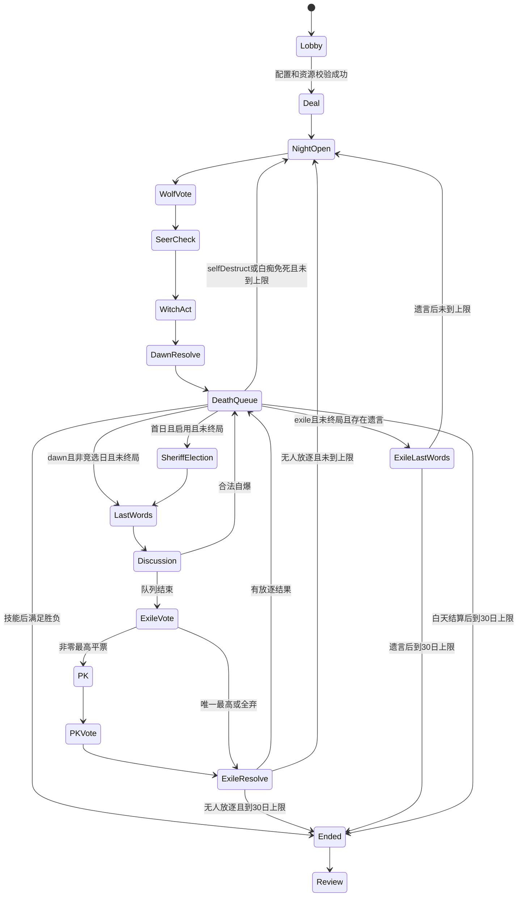

# 规则与玩法规范

版本：1.0。本文中的“必须”是引擎约束。下列规则是项目固定版本，不允许 Host 或 LLM 临场更改。经典组合可由[官方赛事配置](https://langrensha.com/20231110/38720_1119533.html)核实；赛事规则不等于所有民间版本。

## 1. 阵营、配置与身份

总人数含真人一位，其余为 AI；主持人不占座位。座位号 1–N，整局不变；人格身份 playerId 与本局身份 roleId 分离。发牌采用独立种子均匀洗牌，默认真人随机身份，可在开局前选择指定身份用于练习；其余身份仍随机。练习局有标记，不计入正常胜率。

| 人数 | 狼人 | 平民 | 预言家 | 女巫 | 猎人 | 白痴 | 警长 | 狼人胜利 |
|---|---:|---:|---:|---:|---:|---:|---|---|
| 6 | 2 | 2 | 1 | 1 | 0 | 0 | 无 | 屠城 |
| 7 | 2 | 3 | 1 | 1 | 0 | 0 | 无 | 屠城 |
| 8 | 2 | 3 | 1 | 1 | 1 | 0 | 无 | 屠边 |
| 9 | 3 | 3 | 1 | 1 | 1 | 0 | 无 | 屠边 |
| 10 | 3 | 3 | 1 | 1 | 1 | 1 | 有 | 屠边 |
| 11 | 3 | 4 | 1 | 1 | 1 | 1 | 有 | 屠边 |
| 12 | 4 | 4 | 1 | 1 | 1 | 1 | 有 | 屠边 |
| 13 | 4 | 5 | 1 | 1 | 1 | 1 | 有 | 屠边 |
| 14 | 4 | 6 | 1 | 1 | 1 | 1 | 有 | 屠边 |

除经典 12 人外均为项目配置。6、7 人屠城避免只剩两张神导致过早结束；实际强弱由模拟和真人评测调整，调整需发布新 rulesetVersion，不改已开局存档。

好人包括平民和神职；神职包括预言家、女巫、猎人、白痴。警长是附加职务，不改变阵营或屠边分组。死亡默认不翻牌；自爆、猎人开枪及白痴翻牌是公开证明，口头宣称任何身份只是发言。

## 2. 角色动作

| 角色 | 已知信息 | 动作及限制 |
|---|---|---|
| 狼人 | 自己身份、同伴座位；公共记录 | 每夜各投一张暗杀票；可投任一夜初存活者，包括自己、同伴，也可空刀。只公布最终目标给存活狼，不公开个人暗杀票。无夜间私聊 |
| 平民 | 自己身份、公共记录 | 白天发言、放逐投票；夜间无动作 |
| 预言家 | 自己身份、自己的查验历史 | 每夜查验另一名夜初存活者，可重复查验、可跳过；结果仅“狼人/好人”，不显示具体神职 |
| 女巫 | 自己身份、药量；解药尚在时的当夜刀口 | 全局一解药一毒药；每夜最多一瓶。不可自救，首夜也不可；可救刀口，可毒另一名夜初存活者，不能毒自己；可不用药。解药耗尽后不再看到刀口 |
| 猎人 | 自己身份、公共记录、死亡后是否能开枪 | 被狼刀或放逐死亡时可选择带走一名当前存活他人或不开枪；被毒或同时刀毒不能开枪；仅一次，不能主动白天开枪 |
| 白痴 | 自己身份、公共记录 | 首次被放逐自动公开身份并免死，永久失去投票权及被放逐投票资格；仍可发言、可被刀毒枪；不再能任警长 |

[官方白痴说明](https://langrensha.com/hantiao/juese/2018/07/09/26896_763551.html)支持翻牌免放逐及丧失投票权、被投票权。[官方猎人说明](https://langrensha.com/hantiao/juese/2018/07/09/26896_763550.html)支持非毒死亡后的开枪选择。自动白痴翻牌、不可自救及下文终局顺序是项目约定。

## 3. 夜间动作与冲突

每夜所有资格基于夜初快照，未到天亮不修改存活标记。顺序固定为主持人闭眼指令 → 狼人投票 → 预言家查验 → 女巫用药 → 夜间原子结算 → 天亮公布。所有板子都播报同一组主持指令；不存在的角色使用相同通用过场。死亡角色的步骤不跳成可识别提示，避免从等待、按钮或进度推断其存活。

狼人每人一票，锁定后不可更改；其他狼看不到提交次序、个人票或票数。最高票目标胜出，空刀视为一个选项。并列最高时从并列选项中用独立冲突种子均匀抽取，不进行二次沟通；记录在仅 Host 可见审计中。全空票为空刀。网络失败的默认票为空刀。狼队仅在聚合后得到最终刀口；不能获知女巫是否救人。

夜间先计算刀口，再计算救与毒，死亡集合为“未被救的刀口 ∪ 毒药目标”。刀毒同一人只死亡一次，原因集合保留两项；救刀口且被毒仍死亡。女巫中刀仍可以毒人，预言家当夜中刀仍能获得查验，因为行动资格来自夜初。救人消耗解药，即使该人同时被毒；这不是返还条件。毒药提交合法即消耗，不因重复死亡返还。

公开晨报只说死亡座位或平安夜，不说刀口、药物或死因；死亡顺序按座位升序，无死因编码。合法技能提示只给技能本人。没有任何夜间神情更新向闭眼者广播；狼人也看不到预言家、女巫夜间表现。

## 4. 白天与发言

天亮先公开死亡名单，再执行死亡技能及警徽处置、终局判定；若未终局，首日警长板进入竞选，然后遗言、常规讨论和放逐。首夜死者不参加竞选。

无警长时，第一天由种子随机选择一名存活玩家起点，后续每天重新随机起点；按座位顺时针跳过死亡者。警长先选择顺/逆时针；从警长邻位开始，警长最后发言。翻牌白痴仍在发言队列。每人一段，AI 建议 120–280 个汉字，硬上限 400 字；真人硬上限 600 字。发言内容不被 Host 判断真假，允许悍跳、反悔、威胁和误判，但不允许通过文字执行系统动作。

真人无默认倒计时，可主动跳过；暂停时不消耗决策等待时限。AI 请求有服务超时，失败降级为“本轮暂时没有补充观点。”。所有常规发言及神情均为公开；无抢麦、无对话私信。

遗言：首夜死亡者和白天被放逐者各有一段 200 字上限；后续夜死、枪死、自爆者无遗言。白痴免死无遗言（与部分版本不同）。死亡技能优先于遗言；已终局则不再执行遗言或竞选。遗言不是投票或技能窗口。

## 5. 放逐投票

参与者为所有存活且有投票权者，目标为存活且有被放逐资格者；不得投自己，可弃票。普通票权 1，警长 1.5，内部用整数 2/3 计分。所有票密封收集完成后一次公开个人票、弃票和加权总票；提交过程不泄露票数。唯一最高票者放逐；全弃票直接无人出局。

并列最高且非零：并列者按座位顺序各发表一段 PK 发言，最多 200 字；非 PK 且有投票权的存活玩家向 PK 候选人投票或弃票，PK 者不投票。只复投一次；再次平票、全弃票或无合格投票者均无人出局，进入夜间。白痴翻牌免死不能反复进入放逐候选集。

## 6. 警长（10–14 人）

首日夜间结算完成、死亡技能处置及终局检查之后，存活有投票权者同时选择参选/不上警；公布名单，按座位顺序竞选发言，每人最多 280 字。随后同时退水选择，剩余候选名单固定。零候选无警长；一候选直接当选；多候选由未上警者投票（已经退水的原参选者也不得投），可弃票。全部上警导致无选民：无警长。

平票时仅最高候选 PK 一段，再由同一选民集合复投一次；再次平票或全弃票无警长。警长无额外查验权限，常规讨论最后发言，放逐票 1.5，无强制归票权。

警长死亡或白痴翻牌后，在死亡技能处理完且尚未终局时，可将警徽移交一名存活有投票权的他人，或撕毁；撕毁后全局不再竞选。批量死亡中已死亡者不能接徽；人类可点击、AI 用结构化动作。死亡和免死窗口的移交机会各仅一次，不能循环转交。

## 7. 狼人自爆

仅在白天常规讨论、自己的发言轮次开始前或发言提交时可自爆；非自己轮次不能抢断，竞选、遗言、PK、投票、死亡技能不允许。任一存活狼人可用；按钮公开其身份并立即死亡，取消剩余讨论和当天放逐。处理警徽后检查胜负；未结束则进入下一夜。自爆者无遗言。本项目不支持双爆吞警徽等特殊竞赛规则。

## 8. 死亡技能、胜负与防停滞

每个死亡批次顺序必须固定：

1. 原子标记死亡集合，公开名单（夜间死因不公开）。
2. 计算待处理猎人窗口。只要 deathReasons 不含 poison，且含 wolfAttack 或 exile，就提供一次枪杀/放弃。毒死猎人不出现公开身份或公开“不能开枪”提示。
3. 猎人枪杀作为下一死亡批次，公开猎人身份和枪杀目标；无目标时不开枪不主动翻牌。队列清空后进行警徽处置；若此时胜负已确定，略过警徽。
4. 最后检查胜负，未结束才安排遗言或下一阶段。

项目明确采用“死亡技能完成后判定”，因此最后一神猎人能开枪，区别于先屠边判结束的版本。夜间神和最后一狼同时死亡，或猎人最后一枪清空双方：好人优先，因为“狼人全部死亡”先检查；无存活狼→好人胜。否则屠边模式平民为零或神职为零→狼人胜；屠城模式好人为零→狼人胜。存活人数相等或狼更多不会自动判狼胜，不采用绑票自动结算。

若到第 30 个白天仍未结束，在当天所有技能及放逐结算后判和局；所有玩家开局已知限制。无放逐不会即时和局。真人可放弃整局，此为 aborted 不计胜败、不产生经验提升。真人死亡仍可看受限视角或自动快进剩余流程，必须整局结束才能看全知复盘。

## 9. 状态机

图中的 DeathQueue 必须保存 continuation（dawn/discussion/exile/selfDestruct），不能只靠白天/夜间推断返回位置。暂停是运行状态覆盖层而非游戏阶段；恢复从未完成窗口继续。30 日上限检查覆盖无放逐、自爆及技能结算路径。

### 阶段返回的精确定义

| continuation | 技能队列后未终局的下一步 |
|---|---|
| dawn | 首日有警长且尚未竞选→竞选；之后首夜遗言→当日讨论；其他日无夜间遗言→当日讨论 |
| exile | 真正放逐死亡者遗言→下一夜；白痴免死则直接下一夜；枪死者不插入遗言 |
| selfDestruct | 无遗言，直接下一夜 |

日数在进入下一夜时增加一次；第30日不再进入第31夜，转入和局。常规放逐先完成技能、胜负与遗言再检查日上限；自爆与无人放逐无遗言直接检查上限。dawn发生阵营胜负时立即终局，不继续竞选或讨论。next-night需要先完成已公开事件的播放。警长选方向发生在每次常规讨论队列建立前；无人警长时使用种子发言起点。

技能与判定不得以遗言内容为条件；已终局的死亡批次不再安排遗言。所有跳过或不存在的窗口由Host执行固定无动作迁移，不请求不存在的角色。
