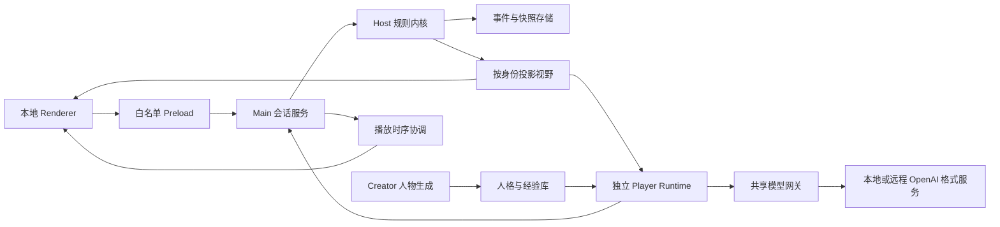

# 架构、数据与协议详细设计

## 1. 架构选择与模块边界

运行于单机 Electron 应用，无远程游戏服务器。推荐 Node.js + TypeScript，界面框架采用 React（可替换，不影响协议），JSON Schema 验证资源及模型动作；这些是设计选择，不代表已安装依赖。开发时选用相互兼容的维护中 Node/Electron 版本并锁定 lockfile，具体版本在开始实现时验证，不在设计中猜测未来兼容性。



| 模块 | 职责 | 输入/输出 | 不允许的依赖 |
|---|---|---|---|
| rules/core | 校验动作、状态迁移、效果队列、胜负 | GameState + Command → 新状态 + DomainEvent[] | LLM、网络、UI、系统时钟 |
| rules/registry | 角色能力与规则插件 | 已验证资源 → RuleBundle | 任意动态 JS/eval |
| session | 唯一写入者、窗口调度、暂停与恢复 | UI/Agent 命令 → accepted/rejected | 绕过 core 写状态 |
| visibility | 权限投影、合法动作与候选目标 | 状态 + principal → Observation | 获取密钥、调用模型 |
| agents | 每个 Player 的 prompt、决策和经验 | 自己 Observation → 候选 Command | 完整 GameState、其他记忆 |
| creator | 批量人物初始化、文本描述验证 | 受控抽样档案 → Persona[] | 游戏身份、密钥文本 |
| llm/gateway | HTTP、能力配置、队列、重试、计量 | messages + request options → parsed candidate | 规则裁决、自动执行技能 |
| storage | 原子事件、快照、人物、迁移 | 已批准状态事务 → 本地文件 | renderer 直接读取 |
| presentation | 事件播放、文本进度、未来语音 | 已授权事件 → displayed/finished | 决定死亡或身份 |

Host 是 core + session 的代码组合。Creator 只在创建/替换朋友时运行，不在每次动作重新创造角色。Agent 的“智能”可变化，但规则确定性不受影响。

## 2. 建议代码及资源布局（仅规划）

- `src/main/`：Electron 生命周期、IPC 会话、配置加载。
- `src/domain/`：引擎类型、Host、效果队列、投影器、种子随机。
- `src/games/werewolf/`：狼人杀能力实现、资源适配、规则测试。
- `src/agents/`：Creator、Player、记忆检索、输出验证。
- `src/llm/`：OpenAI 格式网关、能力配置与预算。
- `src/storage/`：事务文件、恢复及迁移。
- `src/preload/`、`src/renderer/`：受限桥接与页面。
- `src/presentation/`：TextPresenter、SpeechInput/SpeechOutput 接口。
- `resources/games/werewolf/`：roles、presets、rulesets、主持词、玩家手册。
- `resources/personas/`：姓名库、性格词库、衣着和神情动作白名单。
- `resources/schemas/`：资源和协议 Schema；`tests/`：单元、性质、集成、端到端。
- 根目录未来提供 `mystery.sh` 和 `mystery.command`；`api_key.env.example` 只含占位值。

资源包含数据和声明，不允许 JSON 嵌入可执行脚本。GamePlugin 契约：`validateSetup(config) → issues`、`createInitialState(config, seed) → state`、`reduce(state, command) → transition`、`project(state, principal) → observation`、`getManual(ruleset) → text`。泛化边界仅支持注册不同游戏插件；不尝试用文本配置自动执行任意新角色技能。

## 3. 核心实体

所有 ID 为不可复用字符串；seat 为 1–N 整数；时刻仅作日志与 UI 用，不参与规则。以规则计数 day=1 表示第一夜对应白天。

| 实体 | 必填字段与约束 |
|---|---|
| Persona | schemaVersion, playerId, name, demographics, appearanceBase, traits, speechStyle, catchphrases, createdAt；不包含 roleId |
| PersonaDynamics | playerId, energy[0,100], irritability[0,100], experienceCount, updatedAt；只在局间更新 |
| MatchParticipant | seat, actorKind(human/ai), playerId(nullable for human), roleId, faction, alive, voteEligible, exileEligible, revealedRole(nullable), publicAppearance |
| GameState | schemaVersion, gameId, gameType, ruleSnapshot, resourceHashes, seedStreams, version, phase, day, participants, sheriffSeat, badgeDestroyed, abilityState, windows, deathQueue, continuation, outcome |
| AbilityState | potionRemaining、idiotRevealed、hunterShotUsed、privateChecks；按 seat 分区 |
| DecisionWindow | windowId, kind, stateVersion, actorSeats, choicesBySeat, status(open/closed), submittedSeats；外部不可读取其他人的提交状态 |
| DomainEvent | eventId, gameId, seq, batchId, type, day, phase, payload, visibility, stateVersion；权限属于事件元数据，不由 LLM 自报 |
| MatchMemory | playerId, gameId, rulesetId/version, roleId, outcome, observedFacts, hypotheses, reflection, provenanceEventIds；经验只来自本人视角 |
| Outcome | status(good_win/wolf_win/draw/aborted), reason, completedDay, decidedAtSeq |

GameState 永远是主进程私有对象。roleId、阵营统计、PRNG 状态和完整事件日志不能序列化给 renderer。种子采用发牌、狼人平票、发言起点、人格变化独立随机流，避免通过公开随机结果反推身份。存档包含种子用于离线重放，但对参与者不公开。

## 4. 配置契约

角色示例仅示意资源格式；“行为能力”绑定到代码中的能力 ID，不能任意解释自然语言：

```json
{
  "schemaVersion": 1,
  "roleId": "idiot",
  "faction": "good",
  "victoryGroup": "god",
  "displayName": "白痴",
  "abilities": ["revealOnExile"],
  "description": "首次被放逐自动翻牌免死，失去投票与被放逐资格。"
}
```

预设必须包含人数、角色计数、rulesetId、sheriffEnabled、winMode。规则集字段至少包含 `witchSelfSave=false`、`witchBothPotions=false`、`wolfChat=false`、`wolfTie=seededRandom`、`deathSkillBeforeVictory=true`、`lastWords=firstNightAndExile`、`maxDays=30`、`selfDestructWindow=ownDiscussionTurn`。这些键由 Schema 固定枚举，不能用未知字段悄悄改变游戏。

加载校验：人数总和；角色 ID 和能力存在；狼人、平民、神职各至少一人；警长参数与窗口一致；角色上限（四神各≤1）；文本长度；Schema 版本；所有引用可解析。错误显示字段路径，禁止开局。既有资源启动时只读；用户编辑自定义副本后在开局重载，局中不热更新。新规则集需要对应规则测试，JSON 只可修改受支持参数。

人物资源可以增加措辞、衣着、昵称和性格模板；这些不得包含身份判定标签。ruleset 与 manual 的版本绑定，手册由固定规则模板填充，不能由模型自由编造。

## 5. 信息投影与事件权限

`projectObservation(gameId, principal)` 只在可信服务内部使用。UI 的 principal 固定绑定真人座位；AI 的 principal 固定绑定其 seat。任何 IPC 请求不能传任意 seat 来换视角。

| 信息 | 真人/AI 合法读取 |
|---|---|
| 公共主持词、发言、白天投票、死亡座位、公开技能 | 全部参与者 |
| 自己身份、技能资源、已做动作 | 本人 |
| 狼同伴与最终刀口 | 对应存活狼；历史刀口按当时权限保留 |
| 狼人各人的暗杀票及聚合种子 | Host，其他狼也不可看 |
| 查验结果 | 执行该查验的预言家 |
| 解药在手时当夜刀口 | 当夜有女巫行动资格的女巫 |
| 完整身份表、夜间动作、死因、其他玩家思考 | 对局进行中仅 Host |
| AI 私有摘要与反思 | 对应 AI；真人全知复盘也不展示模型思维链 |
| 全知复盘事实 | 终局后真人界面；不自动注入 AI 跨局经验 |

事件 visibility 枚举 `public`、`seats:[...]`、`hostOnly`；夜初角色资格记录在事件受众集合中，之后死亡不使过去合法信息失效。返回视图时移除隐藏事件，并重新生成 viewSeq，不暴露原始全局 seq 的缺口。不得返回“隐藏 3 条”、未知事件 ID、隐藏计数或私有 payload 的空壳。

Observation 必含 ownSeat、day、phasePublicLabel、visibleParticipants（自己真实身份、他人 revealedRole）、visibleEvents、ownPrivateFacts、legalActions、windowId 与 opaque viewRevision。viewRevision 随投影变化而变，不暴露全局事务次数。legalActions 含准确的 actionType、目标座位、可否弃权及字数限制。renderer 与 prompt 不再自行推断权限。

保护措施：先投影再摘要；UI history 查询也重新检查投影；人类死亡不能切换视角；人物弹窗来自稳定外貌和已公开表演，永远不查询 roleId；renderer 不拿全量对象后隐藏；所有模型请求构造路径只接受 Observation。不能通过其他 AI 的失败重试提示泄露其角色，公共状态统一“正在等待本阶段完成”。

模型仍可能猜中角色或主动宣称私有身份，属于策略而非信息泄露；安全保证的是输入无越权真相与无全知数据生成的旁白，而不是保证模型永远不说正确猜测。

## 6. 命令及动作协议

UI 命令示意（非产品实现）：

```json
{
  "commandId": "cmd-unique",
  "gameId": "game-id",
  "windowId": "window-id",
  "viewRevision": "opaque-token",
  "action": {"type": "exileVote", "targetSeat": 5}
}
```

actorSeat 来源于已绑定连接，不信任请求字段。支持的 actionType：`wolfVote(targetSeat|null)`、`seerCheck(targetSeat|null)`、`witchUse(mode:none/save/poison,targetSeat|null)`、`speak(text,gestureId)`、`exileVote(targetSeat|null)`、`sheriffJoin(bool)`、`sheriffWithdraw(bool)`、`sheriffVote(targetSeat|null)`、`chooseDirection(clockwise/counterclockwise)`、`badgeTransfer(targetSeat|null)`、`hunterShoot(targetSeat|null)`、`selfDestruct()`。PK 发言及投票沿用 speak/exileVote，由 window.kind 区分。

主进程验证顺序：认证 game/session → game 未结束 → window 存在且开放 → revision 对应已授权窗口 → 本人有动作资格 → type 合法 → target 在 choices 中 → 文本限制 → 幂等检查 → 原子写入。只有文字中的“我投5号”不提交票；动作提交才有效。

成功返回 accepted、commandId 和新 observation；重复 commandId 且内容相同返回原结果，内容不同报 DUPLICATE_CONFLICT。错误固定为 GAME_ENDED、WINDOW_CLOSED、STALE_VIEW、NOT_ELIGIBLE、INVALID_TARGET、INVALID_PAYLOAD、STORAGE_FAILED；无越权详细数据。已锁定的同一 actor/window 不允许用新 commandId 改票。

同时投票的各人窗口在收集期间保持独立有效，不因其他人的隐藏提交使 revision 失效。阶段闭合后统一失效；迟到模型响应被丢弃，不能写入下一阶段。响应在状态转移和持久化提交成功后才确认；若失败不向玩家显示成功。

## 7. 存储、恢复与复盘

使用 Electron userData 下的独立应用目录；源码根目录不写游戏存档。首版可用 JSON 事务文件而非数据库，未来替换 SQLite 不改变 domain 接口。

- 每个状态转移写入一个事务文件：transactionId、prevVersion、nextVersion、events、nextState 与校验值。先同目录临时文件写入并 flush，再原子 rename；完成才更新内存和确认。
- 单会话写入串行，使用 Electron 单实例锁。恢复按事务版本连续验证，损坏末尾移至隔离目录，停在最后完整事务并告知用户，不猜失踪动作。
- 每 20 个已提交事务及每个阶段边界写快照，保留最后两个快照。快照是加速索引；原始事务是已接受动作的事实来源。
- open windows 和已接受但未聚合的秘密票也在事务中。重启保留已锁票，仅重发未完成 AI 请求；模型响应产生的已接受发言不重生成。
- 未提交响应不存在效果；发言已提交但未播完，恢复允许从该发言起播，标记“恢复播放”，不重复入库、不重复记忆、不重复技能。
- schemaVersion 迁移先备份副本，失败不覆盖旧档；规则及资源保存开局快照/hash，资源后来变化不影响旧局。存档不能随意打开任意下载 JSON 的脚本引用。

复盘分“我的视角”和“全知事实”，整局结束才启用后者。展示逐日公共动作、夜间真相、票型和真实身份，清楚区分模型说法与已验证事件。不展示服务授权头、原始响应 reasoning_content 或其他人私有思维。重放直接应用事件，不调用 LLM；相同初始种子与已接受命令产生相同规则结果，不要求模型跨调用输出确定。

默认自动存档；游戏日志保留最近 100 局，超过上限删除前在设置提供保留策略说明。删除存档与删除朋友档案为不同操作。导出默认仅公开和真人视角记录，去除配置、内部调试和隐藏事件；全知导出仅终局后显式选择。


## 8. 调度契约补充

私密窗口的资格按夜初快照确定，向本人展示时targetSeat:null只代表合法跳过。witchUse(mode=save)的targetSeat只能为本夜刀口且不能为自己；mode=none时targetSeat必须为null，mode=poison时必须在合法他人集合中。模型与UI使用同一约束。

命令中的gestureId为公开发言窗口的可选枚举，缺省neutral；人类可以不提供。私密动作禁止携带公开神情，不能用该字段发出狼队暗号。空发言等同明确跳过并由主持模板记录，不给空文本调用模型的机会。

agent memoryNote在合法动作接受后写入该角色私有工作记忆，不能发送到公共事件，也不能代替结构化事实。只有公开发言进入下一位的Observation；被拒绝动作和模型修复文本不会出现在任何参与者公开历史中。

主进程内部可使用全局stateVersion锁住事务，外部仅使用windowId+不透明viewRevision。单次隐藏投票写入提升全局version但不改变其他投票者合法viewRevision；聚合和阶段切换才关闭窗口。此规则也适用于警长报名、退水和竞选投票。
